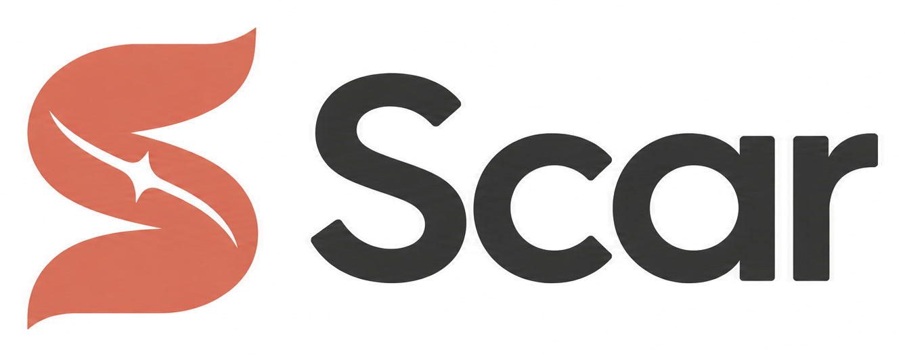

<p align="center">
  <picture>
    <source media="(prefers-color-scheme: dark)" srcset="assets/logo-dark.png">
    
  </picture>
</p>
<p align="center"><strong>Your coding agent shouldn't make the same mistake twice.</strong></p>
<p align="center">Turn review feedback and CI misses into checks for the next change.</p>

<p align="center">
  <a href="LICENSE"></a>
  <a href="https://docs.anthropic.com/en/docs/claude-code"></a>
  
</p>

A reviewer catches a missing validation check. Claude fixes it. Three PRs later, it makes the same mistake. Scar records that feedback as a concrete check that its `/review` command loads next time.

The same idea applies to your workflow: log what slipped past an earlier stage, find recurring causes, and fix the place that should have caught them. **Five slash commands. Three Markdown files.** Works alongside your existing workflow and memory tools.

<p align="center">
  
</p>

## Quick start

1. Install in Claude Code:

   ```text
   /plugin marketplace add kirilklein/scar
   /plugin install scar@scar
   ```

2. Add the [gap-logging snippet](templates/claude-md-snippet.md) to your project's `CLAUDE.md`. It tells Claude to record a miss before fixing it. You can also log one yourself:

   ```text
   /gap test ci "mocks not updated for new return type"
   ```

3. After five or more entries, run `/gaps` to group recurring causes and propose fixes. You approve changes before they are applied.

4. To learn from a past human review, run `/retro <pr-number>`, then use Scar's `/review` on your next diff. Findings drawn from that feedback are tagged `[calibrated]`.

## Example: one review comment, one caught bug

An illustrative walkthrough on a Django shop backend. The diff, comment, and `/retro` output are written for this example; the `/review` output at the end is a real run of the plugin against that code. (The statsmodels retro further down is a real run end to end.)

**1. The change.** A PR speeds up an expiry job by replacing a `save()` loop with one query:

```diff
 def expire_stale_orders(cutoff):
-    for order in Order.objects.filter(status="pending", created_at__lt=cutoff):
-        order.status = "expired"
-        order.save()
+    Order.objects.filter(status="pending", created_at__lt=cutoff).update(status="expired")
```

Tests pass. The local review sees only the changed file and nothing looks wrong.

**2. The reviewer.** A colleague who knows the codebase leaves one comment:

> `update()` skips `save()`, so `updated_at` (an `auto_now` field) stays stale and the `post_save` receiver in `orders/signals.py` that pushes expired orders to the search index never fires. Stale orders keep showing up in search. Load and save, or call the sync explicitly.

The mistake is not in the diff. It is in a file the diff does not touch.

**3. `/retro 42`** reads the comment, decides `/review` could have caught it with the right check, and appends to `.claude/review-calibration.md`:

```markdown
## Bugs
- When a diff introduces `QuerySet.update()`, `bulk_update()` or `bulk_create()` on a model,
  grep for `auto_now` fields on that model and for `post_save`/`pre_save` receivers with
  `sender=<Model>`; flag any that the bulk path now bypasses — learned from PR #42
```

It also adds an Observation to `.claude/lessons.md`: the Order search-index sync lives in `orders/signals.py`, not in the service layer.

**4. Two weeks later**, a different PR makes a payment webhook idempotent, using the same shortcut on a different model:

```diff
     event = json.loads(request.body)
-    invoice = Invoice.objects.get(external_id=event["invoice_id"])
-    invoice.status = "paid"
-    invoice.save()
+    updated = Invoice.objects.filter(
+        external_id=event["invoice_id"], status="open"
+    ).update(status="paid")
+    if not updated:
+        return HttpResponse(status=204)  # already paid or voided; webhook retried
     return HttpResponse(status=204)
```

`/review` on that diff, with the calibration entry loaded:

> **Summary:** The switch to a conditional `update()` correctly fixes the double-processing race on webhook retries, but it silently drops the receipt email and the `updated_at` timestamp.
>
> - **High** `billing/webhooks.py:26` [calibrated] — `QuerySet.update()` bypasses `post_save`, so `email_receipt_when_paid` in `billing/signals.py:8` never fires. Customers stop receiving receipts on every payment. Fix: when `updated` is truthy, call `send_receipt` explicitly, or lock the row with `select_for_update()` and save it. The save path keeps both the signal and the race fix.
> - **Medium** `billing/webhooks.py:26` [calibrated] — `update()` also skips `auto_now` on `updated_at`, so paid invoices keep a stale timestamp. If you keep `update()`, add `updated_at=timezone.now()` to the call.

Output trimmed for length only. The reviewer made the comment once. The check now runs on every review of that repository.

## Commands

| Command | Purpose | When to run it |
|---|---|---|
| `/gap` | Record what slipped through and which stage caught it | When CI, a reviewer, or production reveals a miss |
| `/gaps` | Group misses by root cause and propose a fix for each group | Every week or two, or after five entries |
| `/retro` | Turn human PR feedback into specific review checks and lessons | After a human reviews your PR |
| `/review` | Review a diff using the project's accumulated checks and lessons | Before pushing, or on demand |
| `/promote` | Promote, demote, or retire lessons based on evidence | When lessons need a refresh |

## How it works

### Catch recurring workflow gaps

A **gap** is something a later stage caught that an earlier stage should have. `/gap` records one line in `.claude/workflow-gaps.md`:

```markdown
- [2026-03-12] review → bot-review: changed return type to tuple but only reviewed changed files, not callers
```

The stages use a fixed vocabulary so `/gaps` can count them: `format`, `lint`, `types`, `test`, `review`, `ci`, `bot-review`, `human-review`, `production`, and `tooling`.

`/gaps` shows which stages miss the most, groups entries by root cause, and proposes a fix at the cheapest effective layer. It prefers an automated check, then a better test command or mapping, then a review calibration entry, and finally a lesson. Once you approve the fixes, it applies them and marks the addressed gaps as resolved.

Call `/gap` directly, use the `CLAUDE.md` snippet, or add it to your existing `/ship` or CI-triage command.

### Turn human feedback into review checks

`/retro` reads human PR comments and asks: could `/review` have caught this? Each actionable miss becomes a specific pattern in `.claude/review-calibration.md`:

```markdown
## Bugs
- Watch for off-by-one at pagination boundaries when page_size divides the total — learned from PR #17
```

Scar's `/review` loads that file on each run and marks findings based on those patterns with `[calibrated]`. Codebase gotchas go into `.claude/lessons.md` instead.

### Keep lessons grounded in evidence

Lessons have three confidence levels:

| Level | Evidence | How to use it |
|---|---|---|
| **Observation** | Noticed once | Context to investigate |
| **Proven Pattern** | Confirmed at least twice | Follow by default |
| **Hard Rule** | A violation caused a real failure | Mandatory |

`/promote` checks lessons against the current code and available evidence. It promotes supported entries, demotes contradicted ones, merges duplicates, and retires lessons about deleted code. `/review` reads Proven Patterns and Hard Rules.

## From actual use

The author's logs contain **19 gaps across four projects**, recorded from February to August 2026:

| Expected to catch it | Actually caught it | Gaps |
|---|---|---:|
| Local `/review` | Bot review after push | 6 |
| Tests | Local `/review` | 4 |
| Local `/review` | Human reviewer | 2 |
| Workflow tooling failures | — | 5 |
| Other | — | 2 |

The logs led to two workflow changes:

- **Six misses surfaced in bot review.** The author's workflow now opens the PR before local review, so CI and the bot can run while the diff is being read. Local and remote findings can then be addressed together.
- **Three misses involved callers of changed code.** Searching every use of a changed signature became an explicit review step.

These are examples from one developer's workflow, rather than a benchmark of review accuracy.

<details>
<summary><strong>Example: a maintainer comment becomes a reusable check</strong></summary>

On [statsmodels PR #10223](https://github.com/statsmodels/statsmodels/pull/10223), a maintainer asked for a new `ps_bounds` parameter to accept and validate `array_like` input instead of storing a raw tuple. `/retro 10223` added a project-specific check to `.claude/review-calibration.md`:

```markdown
## Conventions
- A new public sequence-valued parameter (bounds, weights, ranges) must be typed
  `array_like of float` in the docstring, not `tuple of float`, and converted/validated
  at `__init__` with `statsmodels.tools.validation.array_like(value, "name", shape=(n,))`
  — then add an explicit check for what array_like cannot express (value ranges, ordering).
  Flag any new user-facing sequence kwarg stored raw via `self.x = x` — learned from PR #10223
```

The next Scar review loads that check alongside its standard review instructions.

</details>

## Where the feedback lives

All files live in your project's `.claude/` directory. They are plain Markdown; commit them to share the checks with your team.

| File | Updated by | Used by |
|---|---|---|
| `workflow-gaps.md` | `/gap`, `/gaps` | `/gaps` |
| `review-calibration.md` | `/retro`, approved `/gaps` fixes | `/review` |
| `lessons.md` | `/retro`, `/promote`, approved `/gaps` fixes, you | `/review`, `/promote` |

Starter files are in [`templates/`](templates/). Scar adds no runtime or database and does not run your CI or replace your workflow. The commands need to be run: `/gaps` periodically, `/retro` after human feedback, and `/review` to apply the accumulated checks.

## Origins and contributing

Scar began as a full `~/.claude/` configuration. That setup is preserved on the [`config` branch](https://github.com/kirilklein/scar/tree/config), tagged `v0.1-config`.

The most useful contribution is a calibration pattern that caught a real issue. See [CONTRIBUTING.md](CONTRIBUTING.md) and the [calibration pattern issue template](.github/ISSUE_TEMPLATE/calibration-pattern.md).

[MIT license](LICENSE).
